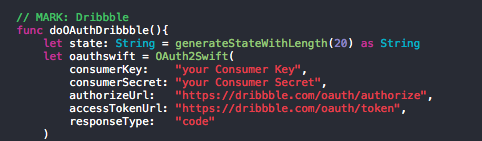
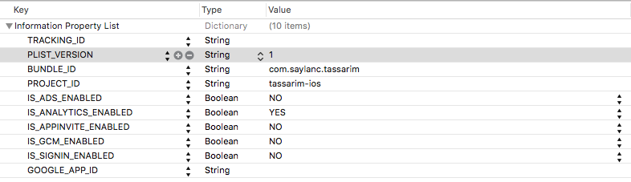

# Tassarim App


Open Source [Dribbble iOS client](https://itunes.apple.com/tr/app/tassarim/id1192816659?mt=8) for [Dribbble](www.dribbble.com), by the creator of [Makale App](https://itunes.apple.com/tr/app/makale-app/id1018812586?mt=8).

## Usage

1) Download the repository

```
$ git clone https://github.com/ssaylanc/tassarim.git
$ cd tassarim
```
    
2) Edit ViewController.swift & URList files.




4) Edit your Google Analytics info (Optional)



4) Open the project in Xcode

```
$ open tassarim.xcodeproj
```

5) Compile and run the app in your simulator

# Requirements

- Xcode 7.3.1
- iOS 9

# Credits

- [Alamofire]() Elegant HTTP Networking in Swift
- [OAuthSwift][] Swift based OAuth library for iOS
- [Spring][] for code-less animation
- [BTNavigationDropdownMenu][] The elegant dropdown menu, written in Swift, appears underneath navigation bar to display a list of related items when a user click on the navigation title.
- [UIColor_Hex_Swift][] Convenience methods for creating color using RGBA hex string.
- [NVActivityIndicatorView][] Collection of awesome loading animations
- [Gifu][] High-performance animated GIF support for iOS in Swift
- [Haneke][] A lightweight zero-config image cache for iOS, in Objective-C.
- [SDWebImage][] Asynchronous image downloader with cache support as a UIImageView category
- [RandomColorSwift][] An attractive color generator for Swift. Ported from randomColor.js.
- [ChameleonFramework/Swift][] Chameleon is a lightweight, yet powerful, flat color framework for iOS
