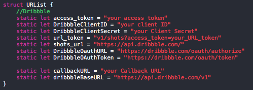

# Tassarim App


Open Source [Dribbble iOS client](https://itunes.apple.com/tr/app/tassarim/id1192816659?mt=8) for [Dribbble](http://www.dribbble.com), by the creator of [Makale App](https://itunes.apple.com/tr/app/makale-app/id1018812586?mt=8).

# Desing

Sketh file is in the Design folder. You it as you like.

## Usage

1) Download the repository

```
$ git clone https://github.com/ssaylanc/tassarim.git
$ cd tassarim
```
    
2) Edit ViewController.swift & URList files. You need to register your app at [Dribbble Developer Portal](http://developer.dribbble.com)




4) (Optional) Edit your Google Analytics info, TRACKING_ID, GOOGLE_APP_ID 


4) Open the project in Xcode

```
$ open tassarim.xcodeproj
```

5) Compile and run the app in your simulator

# Requirements

- Xcode 7.3.1
- iOS 9

# Credits

- [Alamofire](https://github.com/Alamofire/Alamofire) Elegant HTTP Networking in Swift
- [OAuthSwift](https://github.com/OAuthSwift/OAuthSwift) Swift based OAuth library for iOS
- [Spring](https://github.com/MengTo/Spring) A library to simplify iOS animations in Swift
- [BTNavigationDropdownMenu](https://github.com/PhamBaTho/BTNavigationDropdownMenu) The elegant dropdown menu, written in Swift, appears underneath navigation bar to display a list of related items when a user click on the navigation title.
- [UIColor_Hex_Swift](https://github.com/yeahdongcn/UIColor-Hex-Swift) Convenience methods for creating color using RGBA hex string.
- [NVActivityIndicatorView](https://github.com/ninjaprox/NVActivityIndicatorView) Collection of awesome loading animations
- [Gifu](https://github.com/kaishin/Gifu) High-performance animated GIF support for iOS in Swift
- [Haneke](https://github.com/Haneke/Haneke) A lightweight zero-config image cache for iOS, in Objective-C.
- [SDWebImage](https://github.com/rs/SDWebImage) Asynchronous image downloader with cache support as a UIImageView category
- [RandomColorSwift](https://github.com/onevcat/RandomColorSwift) An attractive color generator for Swift. Ported from randomColor.js.
- [ChameleonFramework/Swift](https://github.com/GavinZw/ChameleonFramework) Chameleon is a lightweight, yet powerful, flat color framework for iOS
